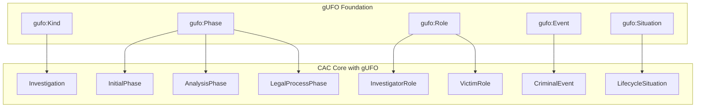
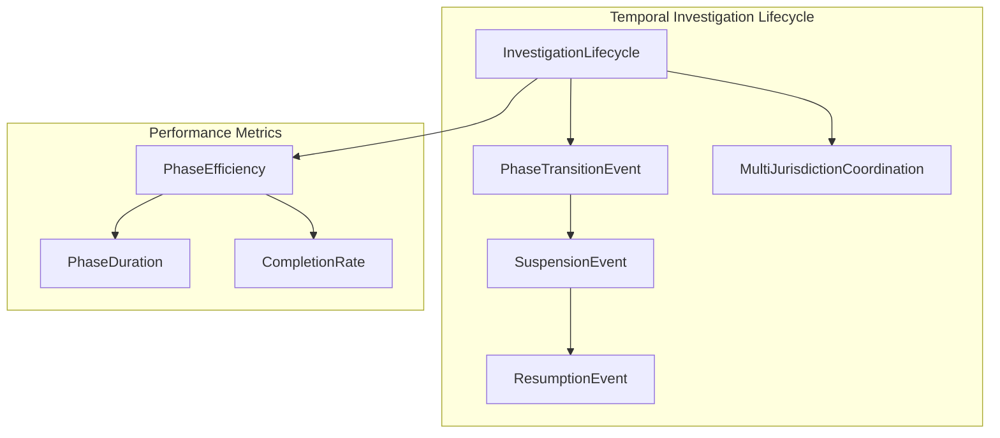
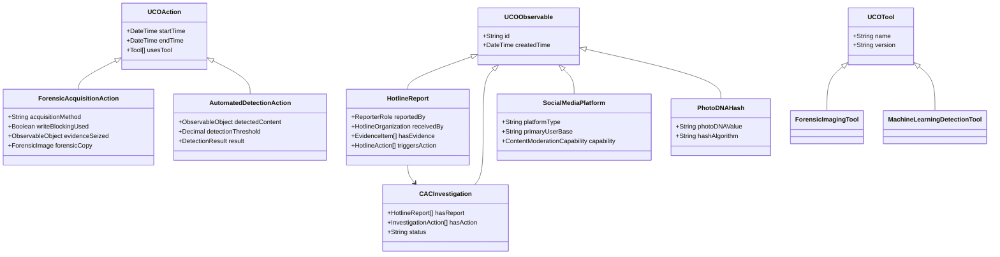

# CAC Ontology Family Architecture

## gUFO Foundational Ontology Integration

The CAC ontology family now includes comprehensive integration with gUFO (Unified Foundational Ontology), providing enhanced semantic precision, temporal modeling, and validation capabilities. This integration consists of three completed phases:

### Phase 1: Core Investigation Modeling (✅ COMPLETE)
**Files**: `cacontology-core-gufo.ttl`, `examples/gufo-phase1-example.ttl`



### Phase 2: Temporal Framework (✅ COMPLETE)  
**Files**: `cacontology-temporal-gufo.ttl`, `examples/gufo-phase2-temporal-example.ttl`



### Phase 3: Full Integration Strategy (✅ COMPLETE)
**Files**: `cacontology-gufo-integration-strategy.ttl`, `examples/gufo-integration-summary.md`

16 specialized integration patterns across all 30+ CAC ontology modules with 345-day deployment timeline.

## Complete Import Chain

```mermaid
graph TD
    subgraph UCO/CASE
        UCO[UCO Core]
        CASE[CASE Investigation]
    end

    subgraph "gUFO Foundation (**NEW**)"
        GUFO[gUFO Core Concepts]
        CAC_GUFO[cacontology-core-gufo.ttl]
        TEMPORAL_GUFO[cacontology-temporal-gufo.ttl]
        STRATEGY_GUFO[cacontology-gufo-integration-strategy.ttl]
    end

    subgraph "CAC Core"
        CAC[cacontology-core.ttl]
        CAC_SHAPES[cacontology-core-shapes.ttl]
        HOTLINES[cacontology-hotlines-core.ttl]
        HOTLINES_SHAPES[cacontology-hotlines-core-shapes.ttl]
        NCMEC[cacontology-us-ncmec.ttl]
    end

    subgraph "International & Global"
        INTERNATIONAL[cacontology-international.ttl]
        TRAINING[cacontology-training.ttl]
        PREVENTION[cacontology-prevention.ttl]
        LEGAL[cacontology-legal-harmonization.ttl]
    end

    subgraph "High-Priority Criminal Activities"
        PRODUCTION[cacontology-production.ttl]
        CUSTODIAL[cacontology-custodial.ttl]
        GROOMING[cacontology-grooming.ttl]
        SEXTORTION[cacontology-sextortion.ttl]
        ATHLETIC[cacontology-athletic-exploitation.ttl]
    end

    subgraph "Specialized Investigation"
        UNDERCOVER[cacontology-undercover.ttl]
        PHYSICAL[cacontology-physical-evidence.ttl]
        TACTICAL[cacontology-tactical.ttl]
        MULTI_JURISDICTION[cacontology-multi-jurisdiction.ttl]
        STRANGER[cacontology-stranger-abduction.ttl]
    end

    subgraph "Technical Support"
        FORENSICS[cacontology-forensics.ttl]
        FORENSICS_SHAPES[cacontology-forensics-shapes.ttl]
        DETECTION[cacontology-detection.ttl]
        PLATFORMS[cacontology-platforms.ttl]
        STREET[cacontology-street-recruitment.ttl]
    end

    subgraph "Victim Services & Legal"
        VICTIM_IMPACT[cacontology-victim-impact.ttl]
        TASKFORCE[cacontology-taskforce.ttl]
        SENTENCING[cacontology-sentencing.ttl]
        SPECIALIZED_UNITS[cacontology-specialized-units.ttl]
        SEX_OFFENDER[cacontology-sex-offender-registry.ttl]
    end

    subgraph Examples
        GUFO_EX1[gufo-phase1-example.ttl]
        GUFO_EX2[gufo-phase2-temporal-example.ttl]
        HOTLINE_EX[hotline-lifecycle.ttl]
        INVEST_EX[investigation-lifecycle.ttl]
        ENHANCED_EX[enhanced-investigation-lifecycle.ttl]
        DOUGLAS_EX[douglas-comprehensive-case.ttl]
        RHODE_ISLAND_EX[rhode-island-production-case.ttl]
        IDAHO_EX[idaho-operation-unhinged-example.ttl]
        ARKANSAS_EX[arkansas-operation-cyber-highway-safety-check-example.ttl]
        REGISTRY_EX[sex-offender-registry-integration-example.ttl]
        ILLINOIS_EX[illinois-attorney-general-case-example.ttl]
        INTERNATIONAL_EX[international-coordination-example.ttl]
        MORTON_EX[brooklyn-morton-october-2024-example.ttl]
        SEXTORTION_EX[wa-sextortion-case-example.ttl]
    end

    GUFO --> CAC_GUFO
    GUFO --> TEMPORAL_GUFO  
    GUFO --> STRATEGY_GUFO
    UCO --> CAC
    CASE --> CAC
    CAC --> CAC_GUFO
    CAC --> HOTLINES
    CAC --> NCMEC
    
    CAC --> INTERNATIONAL
    CAC --> TRAINING
    CAC --> PREVENTION
    CAC --> LEGAL
    
    CAC --> PRODUCTION
    CAC --> CUSTODIAL
    CAC --> GROOMING
    CAC --> SEXTORTION
    CAC --> ATHLETIC
    
    CAC --> UNDERCOVER
    CAC --> PHYSICAL
    CAC --> TACTICAL
    CAC --> MULTI_JURISDICTION
    CAC --> STRANGER
    
    CAC --> FORENSICS
    CAC --> DETECTION
    CAC --> PLATFORMS
    CAC --> STREET
    
    CAC --> VICTIM_IMPACT
    CAC --> TASKFORCE
    CAC --> SENTENCING
    CAC --> SPECIALIZED_UNITS
    CAC --> SEX_OFFENDER

    HOTLINES -.-> HOTLINES_SHAPES
    CAC -.-> CAC_SHAPES
    FORENSICS -.-> FORENSICS_SHAPES
    
    CAC_GUFO --> GUFO_EX1
    TEMPORAL_GUFO --> GUFO_EX2
    HOTLINES --> HOTLINE_EX
    CAC --> INVEST_EX
    FORENSICS --> ENHANCED_EX
    PRODUCTION --> RHODE_ISLAND_EX
    CUSTODIAL --> DOUGLAS_EX
    SPECIALIZED_UNITS --> IDAHO_EX
    MULTI_JURISDICTION --> ARKANSAS_EX
    SEX_OFFENDER --> REGISTRY_EX
    SENTENCING --> ILLINOIS_EX
    INTERNATIONAL --> INTERNATIONAL_EX
    ATHLETIC --> MORTON_EX
    SEXTORTION --> SEXTORTION_EX

    linkStyle 23,24,25 stroke-dasharray: 5 5

    style GUFO fill:#e1f5fe
    style CAC_GUFO fill:#e1f5fe  
    style TEMPORAL_GUFO fill:#e1f5fe
    style STRATEGY_GUFO fill:#e1f5fe
    style GUFO_EX1 fill:#f3e5f5
    style GUFO_EX2 fill:#f3e5f5
```



> **Note**: gUFO components (blue) provide foundational ontology enhancements. Shapes files (dotted lines) are used for validation but not imported by production graphs. All 30+ ontology modules extend the core CAC framework with optional gUFO integration.

### Release Versioning Policy

- The CAC Ontology family uses a **global release version** recorded in `CHANGELOG.md` (for example, `v2.2.0`) to describe the state of the full ontology suite.
- Individual ontology modules (and their SHACL shapes) retain **module-specific `owl:versionIRI` values**, which are only incremented when that particular module’s semantics change.
- This approach avoids churn in ontology IRIs while still providing a clear project-wide release history for implementers and downstream tools.

## Enhanced Data Flow with gUFO Integration

```mermaid
graph LR
    subgraph Input
        JSON[JSON-LD Report]
        API[API Submission]
        FORM[Web Form]
        ESP[Platform ESP Reports]
        ATHLETIC_REPORT[Athletic Coaching Reports]
    end

    subgraph "gUFO Enhanced Processing (**NEW**)"
        PHASE_MODEL[Phase Modeling]
        ROLE_VALID[Role Validation]
        TEMPORAL_CONST[Temporal Constraints]
        ANTI_RIGID[Anti-Rigid Validation]
    end

    subgraph "Detection & Classification"
        HASH[Hash Generation]
        ML[ML Detection]
        MANUAL[Manual Review]
        CLASS[Classification (SAR/COPINE)]
        ATHLETIC_ANALYSIS[Athletic Authority Analysis]
    end

    subgraph "Forensic Processing"
        ACQUIRE[Device Acquisition]
        VERIFY[Evidence Verification]
        CHAIN[Chain of Custody]
        RECOVER[File Recovery]
        TEAM_DYNAMICS[Team Dynamics Analysis]
    end

    subgraph "Platform Cooperation"
        PRESERVE[Data Preservation]
        DISCLOSE[Legal Disclosure]
        MODERATE[Content Moderation]
        INSTITUTIONAL[Institutional Coordination]
    end

    subgraph Storage
        VALID[SHACL + gUFO Validation]
        STORE[Fuseki Store]
    end

    subgraph Output
        CASE[CASE Export]
        SPARQL[Enhanced Analytics]
        REPORTS[Forensic Reports]
        VIZ[Visualization]
        GUFO_ANALYTICS[gUFO Analytics]
        AI_INSIGHTS[AI-Enhanced Insights]
    end

    JSON --> PHASE_MODEL
    API --> PHASE_MODEL
    FORM --> PHASE_MODEL
    ESP --> PHASE_MODEL
    ATHLETIC_REPORT --> ATHLETIC_ANALYSIS
    
    PHASE_MODEL --> ROLE_VALID
    ROLE_VALID --> TEMPORAL_CONST
    TEMPORAL_CONST --> ANTI_RIGID
    
    ANTI_RIGID --> HASH
    HASH --> ML
    ML --> MANUAL
    MANUAL --> CLASS
    ATHLETIC_ANALYSIS --> CLASS
    
    CLASS --> ACQUIRE
    ACQUIRE --> VERIFY
    VERIFY --> CHAIN
    CHAIN --> RECOVER
    RECOVER --> TEAM_DYNAMICS
    
    CLASS --> PRESERVE
    PRESERVE --> DISCLOSE
    DISCLOSE --> MODERATE
    MODERATE --> INSTITUTIONAL
    
    TEAM_DYNAMICS --> VALID
    CLASS --> VALID
    VALID --> STORE
    
    STORE --> CASE
    STORE --> SPARQL
    STORE --> REPORTS
    STORE --> VIZ
    STORE --> GUFO_ANALYTICS
    STORE --> AI_INSIGHTS

    style PHASE_MODEL fill:#e1f5fe
    style ROLE_VALID fill:#e1f5fe
    style TEMPORAL_CONST fill:#e1f5fe
    style ANTI_RIGID fill:#e1f5fe
    style GUFO_ANALYTICS fill:#e1f5fe
    style AI_INSIGHTS fill:#e1f5fe
```

> **Note**: Blue components represent new gUFO-enhanced processing stages that provide semantic validation, temporal modeling, and enhanced analytics capabilities.

## Enhanced Class Hierarchy



## Enhanced Property Relationships

```mermaid
graph TD
    subgraph "Core Investigation"
        I[CACInvestigation]
        R[HotlineReport]
        E[EvidenceItem]
    end

    subgraph "Detection System"
        D[AutomatedDetectionAction]
        DR[DetectionResult]
        H[PhotoDNAHash]
        C[Classification (SAR/COPINE)]
    end

    subgraph "Forensic Analysis"
        FA[ForensicAcquisitionAction]
        FI[ForensicImage]
        RF[RecoveredFile]
        COC[ChainOfCustodyAction]
    end

    subgraph "Platform Context"
        P[SocialMediaPlatform]
        ESP[ElectronicServiceProvider]
        PA[DataPreservationAction]
    end

    I -->|hasReport| R
    R -->|hasEvidence| E
    E -->|detectedBy| D
    D -->|hasResult| DR
    D -->|generatesHash| H
    DR -->|hasClassification| C
    
    I -->|hasStep| FA
    FA -->|producesImage| FI
    FA -->|followedBy| COC
    FI -->|containsFiles| RF
    
    R -->|reportedVia| P
    P -->|operatedBy| ESP
    I -->|requestsPreservation| PA
    PA -->|performedBy| ESP
```

## Complete Ontology Module Reference

The CAC Ontology Family consists of 30+ modules organized by domain:

### Core Framework (3 modules)
- **`cacontology-core.ttl`:** Base investigation framework and lifecycles
- **`cacontology-hotlines-core.ttl`:** Hotline operations and report management
- **`cacontology-us-ncmec.ttl`:** Enhanced NCMEC integration and tip analysis

### International Coordination & Global Frameworks (4 modules)
- **`cacontology-international.ttl`:** Global coordination & cross-border operations (120+ countries)
- **`cacontology-training.ttl`:** Professional development & capacity building (155,000+ professionals)
- **`cacontology-prevention.ttl`:** Prevention programs & education
- **`cacontology-legal-harmonization.ttl`:** International legal framework (196 countries analyzed)

### High-Priority Criminal Activities (5+ modules)
- **`cacontology-production.ttl`:** Child sexual abuse material production
- **`cacontology-custodial.ttl`:** Custodial relationships & positions of trust
- **`cacontology-grooming.ttl`:** Online grooming & enticement
- **`cacontology-sextortion.ttl`:** Sexual extortion incidents
- **`cacontology-athletic-exploitation.ttl`:** Athletic coaching exploitation

### Specialized Investigation Ontologies (5+ modules)
- **`cacontology-undercover.ttl`:** Undercover operations
- **`cacontology-physical-evidence.ttl`:** Physical evidence & procurement
- **`cacontology-tactical.ttl`:** Tactical law enforcement operations
- **`cacontology-multi-jurisdiction.ttl`:** Multi-jurisdictional operations
- **`cacontology-stranger-abduction.ttl`:** Stranger abduction patterns

### Technical Support Ontologies (4+ modules)
- **`cacontology-forensics.ttl`:** Digital forensics
- **`cacontology-detection.ttl`:** Content detection & classification
- **`cacontology-platforms.ttl`:** Technology platforms & service providers
- **`cacontology-street-recruitment.ttl`:** Street-based recruitment patterns

### Victim Services & Task Force Management (5+ modules)
- **`cacontology-victim-impact.ttl`:** Victim impact assessment & recovery
- **`cacontology-taskforce.ttl`:** CAC task force organization
- **`cacontology-sentencing.ttl`:** Legal outcomes & sentencing
- **`cacontology-specialized-units.ttl`:** Specialized units & advanced capabilities
- **`cacontology-sex-offender-registry.ttl`:** Sex offender registry management

### Validation Components (20+ modules)
- **`cacontology-core-shapes.ttl`:** Core validation shapes
- **`cacontology-hotlines-core-shapes.ttl`:** Hotline validation shapes
- **`cacontology-forensics-shapes.ttl`:** Forensic validation shapes
- Plus 17+ additional SHACL validation modules

## UCO/CASE Integration

The enhanced ontology family maximally reuses UCO and CASE concepts:

**UCO Reuse:**
- `uco-observable:File`, `uco-observable:Image` for evidence artifacts
- `uco-types:Hash` for cryptographic hashes
- `uco-tool:AnalyticTool` for forensic and detection tools
- `uco-action:Action` for all investigation actions
- `uco-identity:Organization` for service providers

**CASE Integration:**
- `case-investigation:Investigation` as base for `CACInvestigation`
- Full compatibility with CASE investigation workflows
- Seamless export to CASE format for tool interoperability

## Context Files and API Integration

### JSON-LD Contexts
- **`contexts/hotlines-core.jsonld`:** Complete context for hotline operations
- **`contexts/cacontology-core.jsonld`:** Core investigation context (to be created)

### Example Data Sets (selected files)
- **`hotline-lifecycle.ttl`:** Basic hotline workflow
- **`investigation-lifecycle.ttl`:** Basic investigation workflow
- **`enhanced-investigation-lifecycle.ttl`:** Advanced investigation with forensics
- **`douglas-comprehensive-case.ttl`:** Multi-ontology integration example
- **`rhode-island-production-case.ttl`:** Production case example
- **`idaho-operation-unhinged-example.ttl`:** K9 detection and officer wellness
- **`arkansas-operation-cyber-highway-safety-check-example.ttl`:** Large-scale seasonal operations
- **`sex-offender-registry-integration-example.ttl`:** Registry system integration
- **`illinois-attorney-general-case-example.ttl`:** State-level prosecution and multi-agency coordination
- **`international-coordination-example.ttl`:** Cross-border operations
- **`utah-dominic-christensen-example.ttl`:** Utah recidivism, registry compliance, and NCMEC-driven investigation (introduced in v2.2.0)

### Analytics Queries (selected files)
- **`comprehensive-case-analytics.rq`:** Cross-ontology analytics
- **`find_platform_cooperation_analytics.rq`:** Platform cooperation metrics
- **`find_automated_reports.rq`:** Automated reporting analysis
- **`find_live_stream_incidents.rq`:** Live streaming detection
- **`find_unhandled_reports.rq`:** Report status monitoring
- **`find_rescue_chains.rq`:** Victim rescue tracking
- **`find_report_statistics.rq`:** Statistical analysis
- **`find_open_reports.rq`:** Active case monitoring
- **`find_duplicate_evidence.rq`:** Evidence deduplication
- **`find_cross_border_actions.rq`:** International coordination tracking
- **`find_rescue_statistics.rq`:** Rescue operation metrics
 - **`utah-dominic-christensen-analytics.rq`:** Utah recidivism and NCMEC/registry analytics (timeline, compliance, and victim-centric queries)

## Development and Validation

### Docker Environment
The project includes a complete Docker Compose environment with:
- Apache Jena Fuseki for triple store operations
- pySHACL for validation
- ROBOT for ontology processing
- Automated CI/CD validation pipeline

### Quality Assurance
- ≥ 95% SHACL coverage requirement for object & datatype properties
- Automated validation in CI/CD pipeline
- Performance benchmarks (Q1 query ≤ 500ms on 5M triples)
- Cross-reference validation between ontology modules

See [Glossary](glossary.md) for acronyms and key terms. 